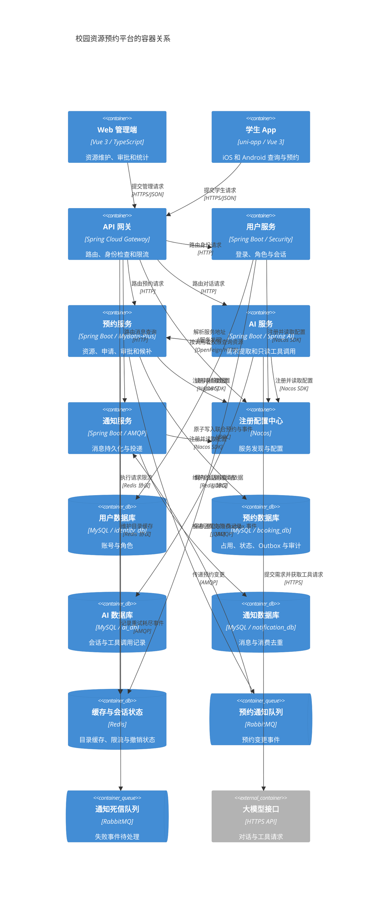

# 校园资源预约平台：服务与数据关系

```mermaid
C4Container
  title 校园资源预约平台的容器关系
  Container(web, "Web 管理端", "Vue 3 / TypeScript", "资源维护、审批和统计")
  Container(app, "学生 App", "uni-app / Vue 3", "iOS 和 Android 查询与预约")
  Container(gateway, "API 网关", "Spring Cloud Gateway", "路由、身份检查和限流")
  Container(identity, "用户服务", "Spring Boot / Security", "登录、角色与会话")
  Container(booking, "预约服务", "Spring Boot / MyBatis-Plus", "资源、申请、审批和候补")
  Container(ai, "AI 服务", "Spring Boot / Spring AI", "需求提取和只读工具调用")
  Container(notice, "通知服务", "Spring Boot / AMQP", "消息持久化与投递")
  Container(nacos, "注册配置中心", "Nacos", "服务发现与配置")
  ContainerDb(identityDb, "用户数据库", "MySQL / identity_db", "账号与角色")
  ContainerDb(bookingDb, "预约数据库", "MySQL / booking_db", "占用、状态、Outbox 与审计")
  ContainerDb(aiDb, "AI 数据库", "MySQL / ai_db", "会话与工具调用记录")
  ContainerDb(noticeDb, "通知数据库", "MySQL / notification_db", "消息与消费去重")
  ContainerDb(redis, "缓存与会话状态", "Redis", "目录缓存、限流与撤销状态")
  ContainerQueue(events, "预约通知队列", "RabbitMQ", "预约变更事件")
  ContainerQueue(deadEvents, "通知死信队列", "RabbitMQ", "失败事件待处理")
  Container_Ext(model, "大模型接口", "HTTPS API", "对话与工具请求")
  Rel(web, gateway, "提交管理请求", "HTTPS/JSON")
  Rel(app, gateway, "提交学生请求", "HTTPS/JSON")
  Rel(gateway, identity, "路由身份请求", "HTTP")
  Rel(gateway, booking, "路由预约请求", "HTTP")
  Rel(gateway, ai, "路由对话请求", "HTTP")
  Rel(gateway, notice, "路由消息查询", "HTTP")
  Rel(gateway, nacos, "解析服务地址", "服务发现")
  Rel(identity, nacos, "注册并读取配置", "Nacos SDK")
  Rel(booking, nacos, "注册并读取配置", "Nacos SDK")
  Rel(ai, nacos, "注册并读取配置", "Nacos SDK")
  Rel(notice, nacos, "注册并读取配置", "Nacos SDK")
  Rel(identity, identityDb, "读写身份数据", "JDBC")
  Rel(booking, bookingDb, "原子写入联合预约与事件", "JDBC")
  Rel(ai, aiDb, "保存会话与查询依据", "JDBC")
  Rel(notice, noticeDb, "保存通知与消费记录", "JDBC")
  Rel(identity, redis, "维护会话撤销状态", "Redis 协议")
  Rel(booking, redis, "维护目录缓存", "Redis 协议")
  Rel(gateway, redis, "执行请求限流", "Redis 协议")
  Rel(ai, model, "提交需求并获取工具请求", "HTTPS")
  Rel(ai, booking, "按调用者权限查询资源", "OpenFeign/HTTP")
  Rel(booking, events, "投递已提交的 Outbox 事件", "AMQP")
  Rel(events, notice, "传递预约变更", "AMQP")
  Rel(notice, deadEvents, "记录重试耗尽事件", "AMQP")
  UpdateLayoutConfig($c4ShapeInRow="3", $c4BoundaryInRow="1")
```

图中四个数据库是数据所有权边界，演示环境可以共用一个 MySQL 实例。场地、设备与预约同属预约服务，联合写入在一个本地事务内完成。

Outbox 事件随业务事务提交后异步投递。发布确认与消费确认分别处理，消费记录通过事件 ID 去重。定时恢复任务由预约服务运行，遵循统一的资源锁与状态转换协议。
