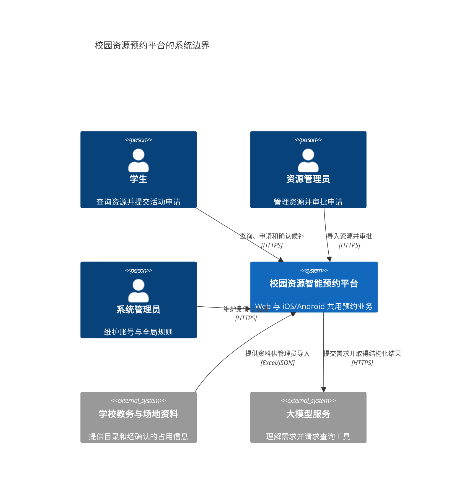

# 校园资源预约平台：系统边界

```mermaid
C4Context
  title 校园资源预约平台的系统边界
  Person(student, "学生", "查询资源并提交活动申请")
  Person(manager, "资源管理员", "管理资源并审批申请")
  Person(admin, "系统管理员", "维护账号与全局规则")
  System(platform, "校园资源智能预约平台", "Web 与 iOS/Android 共用预约业务")
  System_Ext(schoolData, "学校教务与场地资料", "提供目录和经确认的占用信息")
  System_Ext(modelApi, "大模型服务", "理解需求并请求查询工具")
  Rel(student, platform, "查询、申请和确认候补", "HTTPS")
  Rel(manager, platform, "导入资源并审批", "HTTPS")
  Rel(admin, platform, "维护身份与规则", "HTTPS")
  Rel(schoolData, platform, "提供资料供管理员导入", "Excel/JSON")
  Rel(platform, modelApi, "提交需求并取得结构化结果", "HTTPS")
```

学校实时接口尚未确认，图中的资料输入表示导入流程。学校实际占用数据、平台开放规则与平台内预约分别管理。模拟数据标明用途和来源。

大模型服务提出查询请求，实际工具执行和权限检查由平台负责；用户确认后的申请由预约业务处理。
